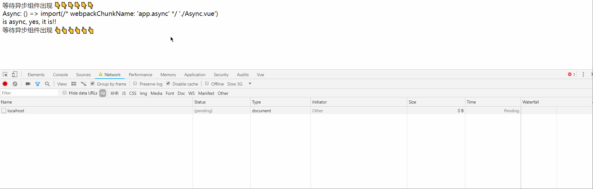

# 为 vue 自定义 webpack

## 热加载
`webpack-dev-middleware`  
`webpack-hot-middleware`  

## 代码分割/离

### 减小入口文件体积
```
// webpack.config.js

module.exports = {
  ...
  optimization: {
    // SplitChunks 插件可以将公共的依赖模块提取到已有的入口 chunk 中，或者提取到一个新生成的 chunk。
    // 在实际代码中的 () => import(/* webpackChunkName: 'app.async' */ './Async.vue') 这类写法 产生的 chunk 不依赖此插件
    splitChunks: {
      chunks: 'all'
    }
  }
  ...
}
```
### 动态导入（vue中）

示例（在 slow 3G 网络下）：


```
new Vue({
  // ...
  components: {
    AsyncCmp: () => import("./AsyncCmp")
  }
});
```

详情查看：  
[1] [https://webpack.docschina.org/guides/lazy-loading/#%E6%A1%86%E6%9E%B6](https://webpack.docschina.org/guides/lazy-loading/#%E6%A1%86%E6%9E%B6)  
[2] [https://alexjover.com/blog/lazy-load-in-vue-using-webpack-s-code-splitting/](https://alexjover.com/blog/lazy-load-in-vue-using-webpack-s-code-splitting/)

## 暂无更多
